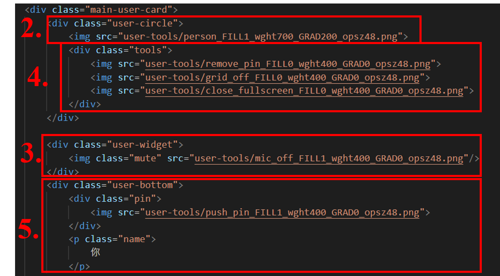

# Web Programming HW#1

## Basic:

1. 我使用flex排版將畫面分成上main-screen與下bottom-info，main-screen又分成左邊main-user-space和左邊sub-user-space(也就是五位餐與者的位置)，參考如下。
  

2. 使用者的介面基本上我是使用一個div做，class為main-user-card與sub-user-card，而我頭像實現方式為依照user-card的高度在中間畫一個綠色的圓(div)，並在中間放上由google fonts上找到的圖(person)。
3. 右上角的靜音圖是我使用一個div做圓底，然後一樣在google fonts上尋找圖示(mic off)並放置中間。
4. 指定主要使用者頭像中間的工具組，我使用div做，class命名為tools，並在中間放置三個圖示，其中左邊與中間圖式無法在Google Fonts找到，所以我自行使用PowerPoint在pin與grid上畫斜線。其hover的設定根據講義85頁設定三種情況並改變其opacity來達到指定要求。
5. 我在底下創建一個div並命名class為user-bottom，用來放置anchor的圖示(pin)與名字。  

6. 五位其他的參與者製作方式同上，只差沒有中間的tools與名字前面的anchor。其中其排列的方式為使用flex，並設定flex-wrap: wrap; 以達到換行，justify-content: space-evenly; 如此才會左邊中間以及右邊間距都同寬，最後使用align-content: center; 使sub-user-card停留中間，而sub-user-card上下的空間為設定margin-top製造出的效果。

7. 如1.提到，底下的功能列被劃分至bottom info的div中，並再以time-meeting-name、bottom-buttons與bottom-sub-buttons三個平分(flex實現)的div，並設定其justify-content為flex-start、center、flex-end達到時間靠左，主要功能置中與其他類似按鈕的資訊靠右，align-items設定center讓其在div的中間。圖示也都以Google fonts為主，若無則以相似並加工的代替。

## Bonus:
1. 當游標滑⾄每個功能按鈕之上(hover)時，會在功能按鈕上⽅顯⽰此功能之提⽰。  
   這算蠻好實現的，使用position: absolute與transform等properities能夠很好的把文字div放置在按鈕上方，接著再使用hover與opacity的改變，加上transition-delay: 0.3s，便可以製作出停留在按鈕上一陣子後顯示按鈕資訊。
   
2. 點擊靜⾳按鈕時，可以切換靜⾳/無靜⾳。當然，不⽤真的做到有聲⾳與影像的功能，只是做出按鈕圖⽰變換的效果。  
   參考講義p.81到p.83便可以做出類似的效果，而我將變色效果改成便透明度，所以跌了兩層圖示，最上面為麥克風關閉，下面為麥克風開啟，勾選後上面的opacity變為0，則下面的圖示就會露出，製作出切換按鈕的效果，視訊按鈕效果一樣所以我也有做上去。另外我也有將button-info的div也放入label中，所以切換按鈕顯示的button-info也能夠顯示不同提示。  
   
3. 做到「Responsive Webb Design (RWD)」，讓網⾴在放⼤、縮⼩時排版不⾄於亂掉，⽽仍保有原來完整的功能。  
  我並沒有完全按照講一中的RWD製作，不過我很多的布局都用切版並上層container的比例去製作，所以我自己在測試縮放時並沒有很誇張地跑版。
  
