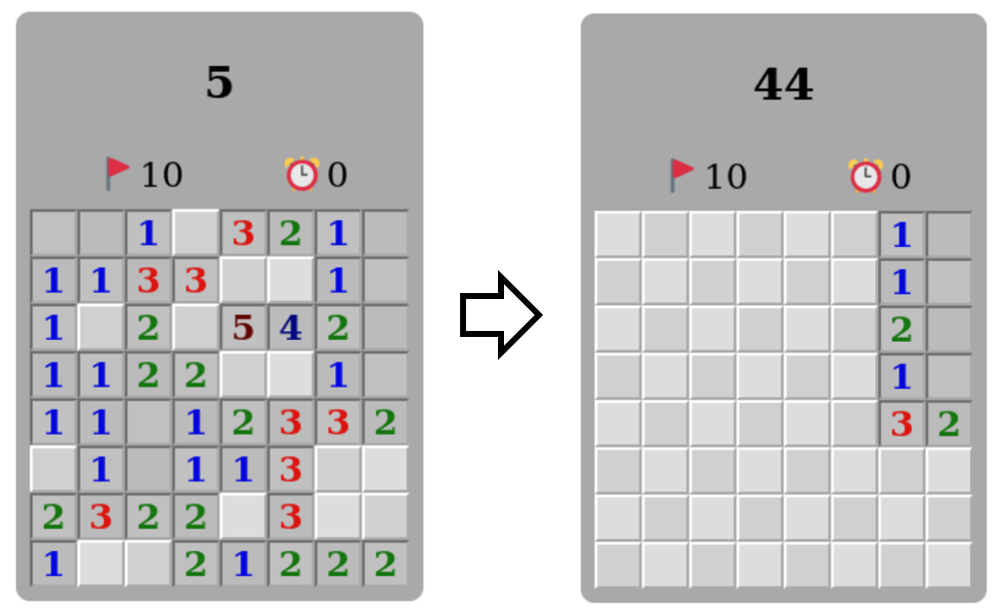

# HW4 MineSweeper

## main feature
主要我覺得比較難的是設計怎麼樣在按到0的時候能夠擴張
最一開始想到的就是DFS，可惜最一開始沒有設好條件，導致所有的相連的都會被打開，導致過於容易，也與真實的不同，後續更改DFS的架構才稍微有樣子

同樣點右上角，右邊自動展開的規則就比較合理  
其他包括難易度設定、旗子的插拔數量設定有完成、跳轉頁面也有

---
---

## [Demo Video](https://www.youtube.com/watch?v=mDx4bi-rA-Q)

## Structure

## File Structure

## Our Rules of MineSweeper

## Structure of HTML

